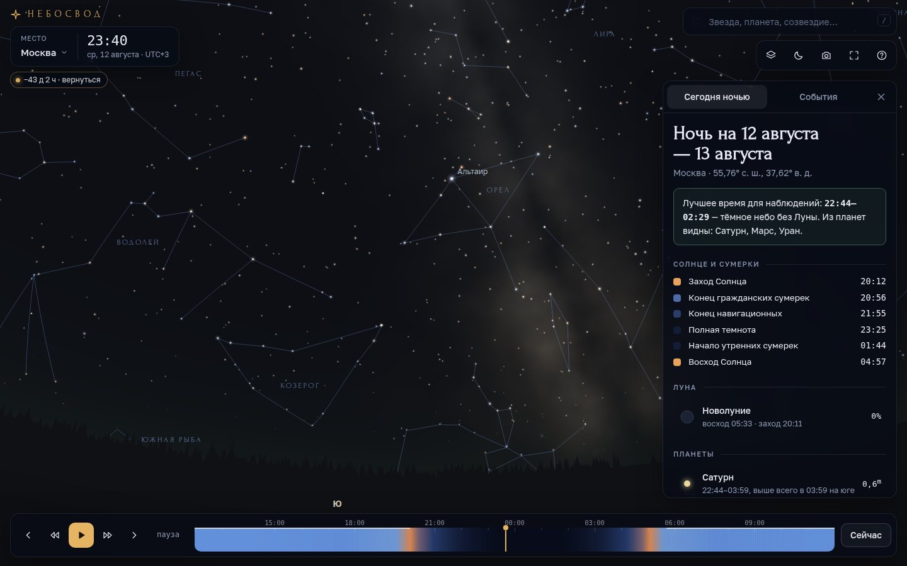
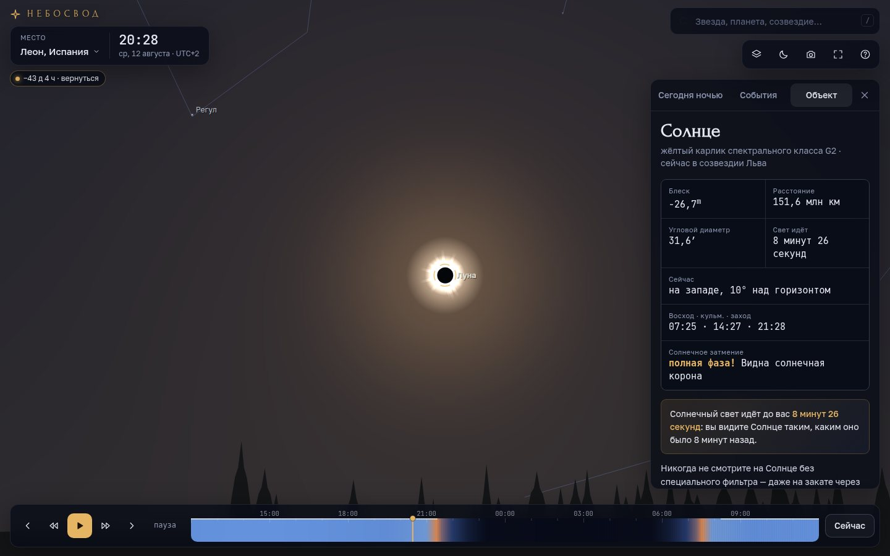
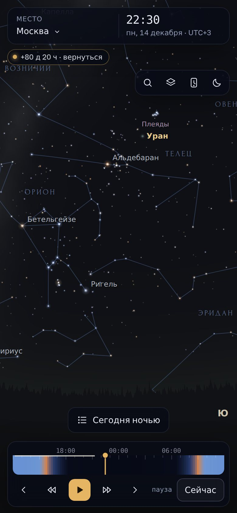

# Небосвод

**Живая карта звёздного неба в браузере.** Звёзды, планеты, Луна, сумерки, затмения и метеорные потоки над любой точкой Земли: сейчас, в прошлом и в будущем. Всё считается прямо на устройстве, без сервера и без интернета. Приложение — один HTML-файл весом около 570 КБ.



## Что умеет

- **Реальное небо над вами.** Около 5 000 звёзд каталога Hipparcos с настоящими цветами, 88 созвездий с фигурами и границами, объекты Мессье, Магеллановы Облака. Всё подписано по-русски.
- **Физически правдоподобная атмосфера.** Голубое дневное небо и оранжевое зарево на закате. Тень Земли и розовый пояс Венеры на противоположной стороне. Засветка от города по шкале Бортля, лунный свет, мерцание звёзд у горизонта, атмосферная рефракция и поглощение света.
- **Процедурный Млечный Путь.** Балдж к центру Галактики, звёздные облака, Большой Разлом, Угольный Мешок. Проявляется только под тёмным небом, как в жизни.
- **Луна с настоящей фазой и ориентацией.** Моря на своих местах, пепельный свет у серпа, медно-красная Луна в тени Земли во время лунного затмения.
- **Солнечные затмения.** Диск Луны закрывает Солнце, небо темнеет, в полной фазе видна корона и проступают звёзды.
- **Машина времени.** Небо над выбранным городом в любую дату с 1000 по 3000 год: в день вашего рождения, в ночь полёта Гагарина, в день будущего затмения. Время можно ускорять и запускать назад.
- **«Сегодня ночью».** Когда стемнеет, что за Луна, какие планеты видны и где их искать. Лучшее время для наблюдений — когда темно и Луна не мешает. Всё это работает и для полярного дня, и для белых ночей.
- **Календарь неба.** Фазы Луны, сближения Луны с планетами и яркими звёздами, противостояния, элонгации, максимумы метеорных потоков. Солнечные и лунные затмения на год вперёд, с пометкой, видно ли их в вашем городе и какая часть Солнца закроется.
- **Метеоры** вылетают из радиантов активных потоков с реальной частотой. Если ускорить время, видно, как поток «работает» за ночь.
- **История света.** Для каждой звезды приложение говорит, когда вышел свет, который вы видите, и что тогда ещё не случилось. Например: *«Свет Полярной звезды отправился в путь около 1593 года — до первых наблюдений Галилея в телескоп оставалось ещё 16 лет»*.
- **Режим дополненной реальности.** Наведите телефон на небо, и карта повернётся вслед за ним. Можно включить изображение с камеры.
- **Красный ночной режим** сохраняет тёмную адаптацию глаз при наблюдениях.
- **Офлайн и установка на телефон** (PWA): незаменимо за городом, где нет связи.

| Полное солнечное затмение 12.08.2026, Леон (Испания) | На телефоне |
| --- | --- |
|  |  |

## Управление

| Действие | Мышь / касание | Клавиша |
| --- | --- | --- |
| Осмотреться | перетащить небо | ← → ↑ ↓ |
| Масштаб | колесо, щипок, двойной клик | `+` `−` |
| Об объекте | нажать на звезду, планету, туманность; на пустое небо — о созвездии | |
| Поиск | поле вверху справа | `/` |
| Время | шкала суток внизу, кнопки ⏪ ⏯ ⏩ | `Пробел`, `[` `]`, `N` — сейчас |
| Слои | кнопка со слоями | `C` созвездия, `M` Млечный Путь, `A` атмосфера, `G` земля, `D` туманности, `B` границы, `E` эклиптика |
| Ночной режим | кнопка с луной | `R` |

Горячие клавиши работают и в русской раскладке.

## Запуск

Нужен Node.js 20 или новее.

```bash
npm install
npm run dev      # разработка: http://localhost:5173
npm test         # 41 тест астрономического ядра и данных
npm run build    # сборка в dist/
```

После сборки `dist/index.html` — это готовое приложение одним файлом. Его можно открыть прямо с диска, отправить другу или выложить на любой хостинг. Рядом лежат `sw.js`, манифест и иконки для офлайн-режима и установки на телефон.

### GitHub Pages

Рабочий процесс `.github/workflows/pages.yml` при каждом push в `main` собирает и публикует приложение. Нужно один раз включить Pages: **Settings → Pages → Source: GitHub Actions**. Пока Pages выключены, процесс не падает, а только пишет подсказку.

## Точность

Астрономия написана с нуля и проверена тестами на эталонных примерах:

| Что | Метод | Проверка |
| --- | --- | --- |
| Солнце | Ж. Миус, «Астрономические алгоритмы», гл. 25 | пример 25.a, ±0.005° |
| Луна | ELP-2000/82 в сокращении Миуса (60 + 60 членов), топоцентрический параллакс | пример 47.a, ±0.005°; фазы Луны ±10 мин |
| Планеты | кеплеровы элементы JPL (Standish), время распространения света | пример 33.a; противостояния 2024–2025 ±0.1° |
| Прецессия, звёздное время, рефракция | Миус, гл. 12, 21; Сэмундссон; воздушная масса по Пикерингу | примеры 12.a, 21.b, 13.b |
| Восходы и заходы | численный поиск пересечений, работает за полярным кругом | Москва 21.06.2025 — до минуты; Мурманск — полярная ночь |
| Затмения | тень Земли по Данжону, местные обстоятельства | все затмения 2025–2027 совпадают с каталогом NASA по дате и типу; максимум лунного затмения 14.03.2025 — в пределах 5 мин |
| Созвездие по координатам | границы МАС в эпохе B1875, где их стороны прямые | ≥ 99,5 % совпадений с обозначениями Байера |

Планеты точнее всего в 1800–2050 годах. За этими пределами ошибка растёт, но для карты неба остаётся приемлемой.

## Устройство

```
src/
  astro/   время, координаты, Солнце, Луна, планеты, восходы, затмения, метеорные потоки
  data/    каталоги (сгенерированы), города, справочник: расстояния, факты, падежи
  sky/     камера (стереографическая проекция), атмосфера, Млечный Путь, пейзаж, отрисовка
  ui/      форматирование по-русски, «Сегодня ночью», панели, шкала суток, AR
  app.js   контроллер: время, место, ввод, панели
scripts/   сборка, генерация данных, dev-сервер
test/      node:test — ядро, события, данные, форматирование
```

Отрисовка идёт на Canvas 2D. Фон (атмосфера и Млечный Путь) считается попиксельно в буфере пониженного разрешения, а звёзды, линии, Луна и подписи рисуются векторно поверх. Пока небо движется, фон считается в ещё меньшем разрешении, поэтому анимация плавная и на телефоне.

## Данные и благодарности

- Звёзды, созвездия, объекты Мессье — [d3-celestial](https://github.com/ofrohn/d3-celestial) © 2015 Olaf Frohn, BSD-3-Clause. Исходные каталоги: Hipparcos, HYG, границы созвездий МАС. Подробнее — в [THIRD_PARTY.md](THIRD_PARTY.md).
- Алгоритмы — Jean Meeus, *Astronomical Algorithms*, 2nd ed.; E. M. Standish, *Keplerian Elements for Approximate Positions of the Major Planets* (JPL).
- Календарь метеорных потоков — Международная метеорная организация (IMO).
- Шрифты — Forum, Golos Text, JetBrains Mono (Google Fonts, OFL).

Код распространяется по лицензии [MIT](LICENSE).
